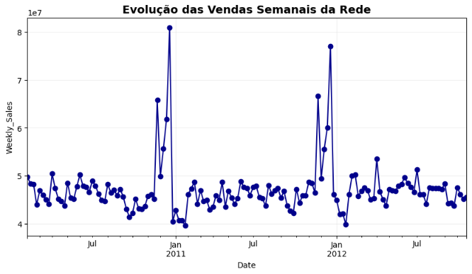
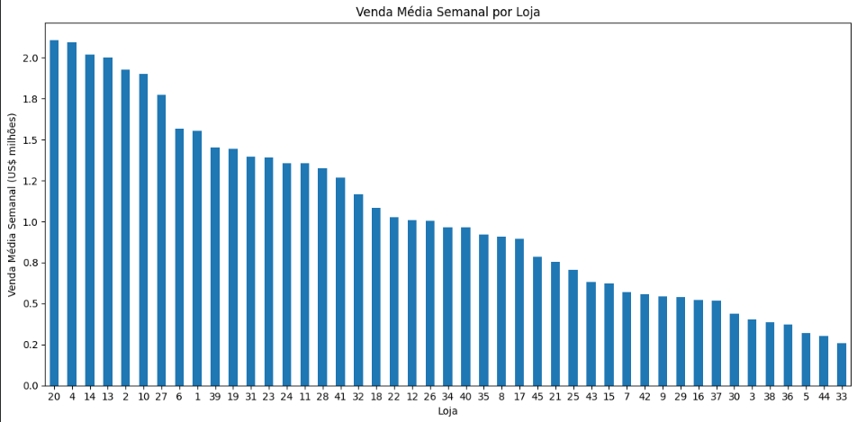
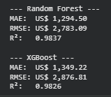
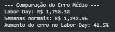

# 📊 Walmart Store Sales — Análise e Previsão de Vendas

Projeto de análise de dados e Machine Learning desenvolvido a partir do dataset **Walmart Recruiting - Store Sales Forecasting**, com o objetivo de explorar o comportamento das vendas e construir modelos capazes de prever as vendas semanais de lojas e departamentos.

O projeto envolve preparação e integração dos dados, análise exploratória (EDA), Feature Engineering, validação temporal, criação de um baseline, treinamento de modelos de Machine Learning e análise dos erros de previsão.

---

## 🎯 Objetivo

O projeto busca responder à seguinte pergunta:

> **É possível utilizar o histórico de vendas e as características das lojas para prever as vendas semanais e identificar situações em que essas previsões se tornam mais difíceis?**

Além da construção do modelo preditivo, foram investigados:

- comportamento das vendas ao longo do tempo;
- diferenças entre lojas e departamentos;
- impacto de feriados;
- relação entre MarkDowns e vendas;
- relação das vendas com temperatura, preço dos combustíveis, CPI e desemprego;
- situações em que o modelo apresenta maiores erros.

---

## 📂 Dados

O dataset é composto por diferentes tabelas contendo informações sobre:

- vendas semanais por loja e departamento;
- características das lojas;
- feriados;
- MarkDowns;
- temperatura;
- preço dos combustíveis;
- CPI;
- desemprego.

As bases foram integradas e preparadas para permitir tanto a análise exploratória quanto a construção dos modelos.

---

## 🔎 Análise Exploratória

A análise mostrou diferenças importantes no comportamento das vendas entre lojas e departamentos.

Também foram identificadas oscilações ao longo do tempo, incluindo picos próximos aos períodos de fim de ano, sem evidência de uma tendência contínua de crescimento ou queda durante todo o período analisado.



As variáveis externas, como temperatura, preço dos combustíveis, CPI e desemprego, apresentaram correlações lineares fracas com as vendas semanais.

As variáveis de MarkDown também foram analisadas individualmente. Os resultados indicaram relações limitadas, reforçando que o comportamento das vendas não pode ser explicado por apenas uma variável isolada.

### Lojas e departamentos

A análise também mostrou diferenças relevantes entre lojas e departamentos.

O tamanho das lojas apresentou forte associação com as vendas médias, enquanto alguns departamentos se destacaram pelo volume de vendas e pelo comportamento observado entre diferentes lojas.



---

## 🛠️ Feature Engineering

Para representar melhor o comportamento temporal das vendas, foram criadas novas variáveis a partir das informações disponíveis.

Entre elas:

- ano;
- mês;
- semana do ano;
- identificação de períodos de feriados;
- venda da semana anterior (`Lag_1_Week`);
- venda de quatro semanas anteriores (`Lag_4_Weeks`);
- média móvel das últimas quatro semanas (`Rolling_Mean_4_Weeks`).

As variáveis baseadas no histórico foram criadas utilizando apenas informações anteriores à semana prevista, evitando o uso direto de informações futuras.

---

## ⏳ Validação Temporal

Como os dados possuem natureza temporal, não foi utilizada uma divisão aleatória entre treino e validação.

As **10 semanas finais** do conjunto de dados foram utilizadas para validação, enquanto as semanas anteriores foram utilizadas para treinamento.

| Conjunto | Semanas |
|---|---:|
| Treino | 129 |
| Validação | 10 |

Essa estratégia permite avaliar os modelos em um período posterior aos dados utilizados durante o treinamento.

---

## 📏 Baseline

Antes dos modelos de Machine Learning, foi criado um baseline simples:

> **Utilizar a venda da semana anterior como previsão para a semana atual.**

O baseline apresentou:

| Métrica | Resultado |
|---|---:|
| MAE | R$ 1.546,34 |
| RMSE | R$ 3.557,42 |
| R² | 0,9734 |

Apesar da simplicidade, o bom desempenho do baseline mostra que existe forte continuidade temporal no comportamento das vendas.

---

## 🤖 Machine Learning

Foram avaliados dois modelos:

- **Random Forest Regressor**
- **XGBoost Regressor**

Os resultados foram:

| Modelo | MAE | RMSE | R² |
|---|---:|---:|---:|
| Baseline | R$ 1.546,34 | R$ 3.557,42 | 0,9734 |
| **Random Forest** | **R$ 1.294,50** | **R$ 2.783,09** | **0,9837** |
| XGBoost | R$ 1.349,22 | R$ 2.876,81 | 0,9826 |



O **Random Forest apresentou o melhor desempenho** entre as abordagens avaliadas.

Em comparação ao baseline, o modelo reduziu:

- **MAE em aproximadamente 16,3%**
- **RMSE em aproximadamente 21,8%**

Os resultados mostram que o modelo conseguiu gerar ganho em relação à estratégia simples de utilizar apenas as vendas da semana anterior.

---

## 🔍 Análise dos Erros

Além das métricas gerais, foram analisadas situações em que o Random Forest apresentou maior dificuldade.

### Departamentos com maior erro médio

| Departamento | Erro absoluto médio |
|---:|---:|
| 38 | R$ 5.311,90 |
| 72 | R$ 5.244,88 |
| 3 | R$ 4.524,42 |
| 92 | R$ 3.628,47 |
| 9 | R$ 3.436,31 |

### Lojas com maior erro médio

| Loja | Erro absoluto médio |
|---:|---:|
| 4 | R$ 2.149,45 |
| 13 | R$ 2.078,59 |
| 20 | R$ 2.043,80 |
| 14 | R$ 2.037,66 |
| 17 | R$ 1.966,79 |

Esses resultados mostram que o bom desempenho geral do modelo não significa que todas as lojas e departamentos possuam o mesmo nível de previsibilidade.

---

## 📅 Impacto do Labor Day

Também foi analisado o desempenho do modelo durante o Labor Day.

| Período | Erro absoluto médio |
|---|---:|
| Labor Day | R$ 1.758,38 |
| Semanas normais | R$ 1.242,96 |



O erro foi aproximadamente **41,5% maior durante o Labor Day** em comparação às semanas normais.

Esse resultado indica que, apesar do bom desempenho geral do modelo, períodos associados a eventos especiais podem apresentar padrões de vendas mais difíceis de prever.

---

## 💡 Principais Conclusões

A análise permitiu identificar que:

- lojas e departamentos apresentam comportamentos de vendas distintos;
- existem oscilações temporais relevantes, principalmente próximas a períodos de fim de ano;
- variáveis externas analisadas individualmente apresentaram correlações lineares fracas com as vendas;
- o histórico recente possui forte poder preditivo, como demonstrado pelo desempenho do baseline;
- o Random Forest apresentou o melhor desempenho entre os modelos avaliados;
- o Random Forest reduziu o MAE em aproximadamente **16,3%** e o RMSE em **21,8%** em relação ao baseline;
- determinados departamentos e lojas apresentam erros de previsão significativamente maiores;
- durante o Labor Day, o erro médio foi aproximadamente **41,5% maior** do que nas semanas normais.

O projeto demonstra a importância de não avaliar um modelo apenas por uma métrica geral. A comparação com um baseline e a investigação dos erros permitiram entender melhor tanto os ganhos quanto as limitações do modelo.

---

## 🧰 Tecnologias Utilizadas

- Python
- Pandas
- NumPy
- Matplotlib
- Seaborn
- Scikit-learn
- XGBoost
- Google Colab

---

## 📁 Estrutura do Repositório

```text
walmart-store-sales/
│
├── Walmart_Recruiting.ipynb
├── README.md
│
└── images/
    ├── vendas_semanais.png
    ├── vendas_lojas.png
    ├── comparacao_modelos.png
    └── erro_labor_day.png
```

---

## 👨‍💻 Autor

**Fernando Araujo de Freitas**

Projeto desenvolvido como parte do meu portfólio de **Análise de Dados e Ciência de Dados**.